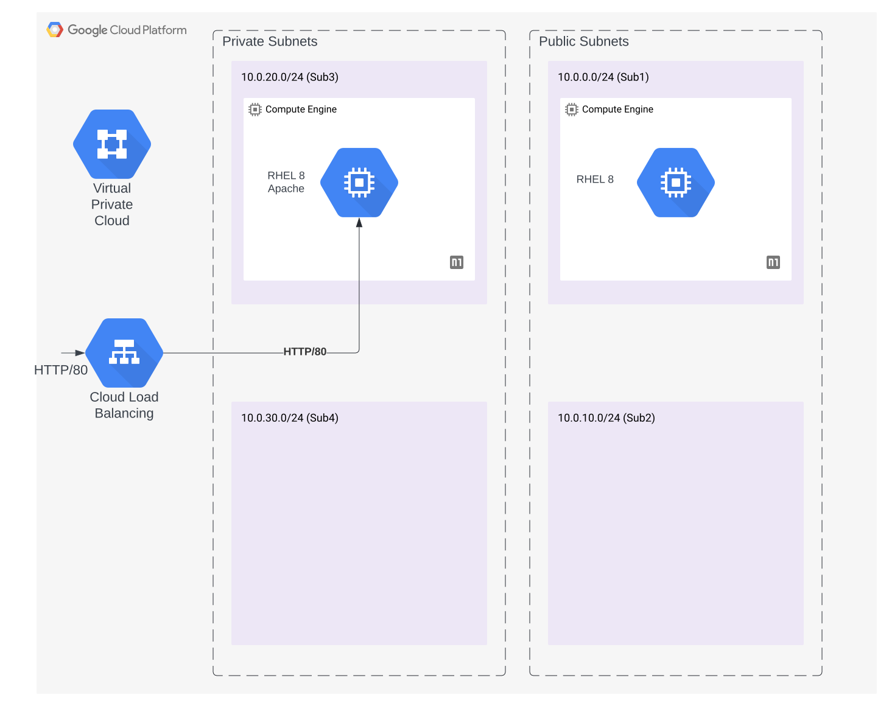

# GCP-Lab

A project to deploy a lab environment for GCP.

## Details

This lab implements the following:

- (1) VPC
  - (4) Subnets
    - (2) subnets reachable from the internet
    - (2) subnets unreachable from the internet
  - (2) Red Hat Enterprise Linux 8 VMs
    - (1) VM on the first subnet that is available over the internet, allowing `ping` and `ssh`
      - 20 GB of storage
    - (1) VM on the third subnet that is **not** available over the internet
      - scripted installation of `apache` web server, listening on port 80
      - `apache` reachable via HTTP load balancer (port 80)
      - 20 GB of storage
  - HTTP Load Balancer servicing port 80 to an Apache sever running on the host in subnet 3
    - HTTP health checks for the service
  - DNS configuration for the internet reachable VM at `ssh.lab.elasticplayground.dev`
  - DNS configuration for the HTTP load balancer at `http.lab.elasticplayground.dev`
  - Web Application Firewall policy applied at the HTTP load balancer that blocks:
    - `SQL Injection`

### Diagram

There is only a single WAF signature being utilized (`sql injection`) for a few reasons:

- demonstrates the proof-of-concept configuration
- risk of production issues is higher when implementing a WAF policy without a baseline of traffic to base the policy against
- we want to go through a few threat modeling exercises to articulate the threats we should target in the WAF policy
- we will use the outputs from the threat modeling exercises to produce the WAF policy/configuration in more granularity for the service' use case

### Caveats

This project does not utilize GCP `projects` or `folders` because they require GCP `Organizations`, and our GCP account does not currently have an `Organization` configuration.

#### Questions

- What (if any) roles should be configured (e.g. Shared VPC Admin)?
- Should the VPC be a Shared VPC?
- Should the subnets be configured to permit intercommunication (e.g. Sub1 can communicate with Sub2)?
  - Should hosts be further segmented intra-subnet (e.g. 10.0.0.1 -> 10.0.0.2 and vice versa on sub1)
- Should all egress traffic be permitted outbound for both zones (public/private)?
- Which protocols/ports should be permitted from the internet to the public subnets? (e.g. just ICMP and SSH?)

## References

- [GoogleCloudPlatform/lb-http terraform module](https://registry.terraform.io/modules/GoogleCloudPlatform/lb-http/google/latest)
- [GCP Terraform Provider Documentation](https://registry.terraform.io/providers/hashicorp/google/latest/docs)
- [GCP Documentation](https://cloud.google.com/docs/)
